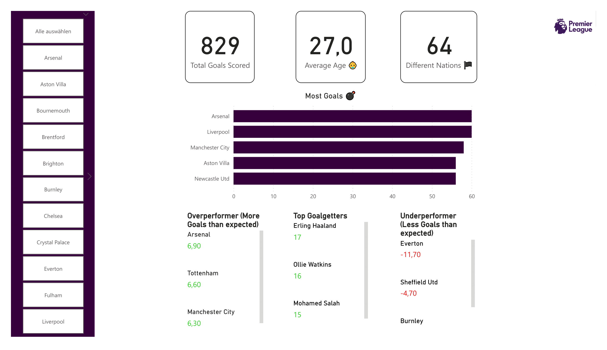

# Premier League Dashboard

Tracking KPIs of the Premier League (English Soccer). Updated daily.

Since I don't have the Pro License for Power BI, I can't publish it 😢

# How it works

Every day at midnight, the Python script grab the latest data from [FBREF](https://fbref.com/en/) and load it into MongoDB Atlas.

Power BI just grabs the data via MongoDB Atlas Connector.
